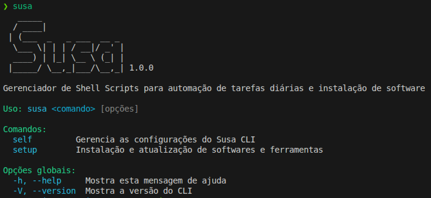

# Susa CLI

Framework modular em Shell Script para criar CLIs extensíveis com descoberta automática de comandos, sistema de plugins e suporte a autocompletar.



## ✨ Características

- 🔍 **Discovery Automático** - Comandos descobertos da estrutura de diretórios
- 📦 **Sistema de Plugins** - Extensível via repositórios Git
- 🎯 **Subcategorias Multi-nível** - Hierarquia ilimitada de comandos
- 🖥️ **Multi-plataforma** - Linux e macOS
- 📚 **Bibliotecas Reutilizáveis** - Logger, detecção de SO, parser YAML e mais
- ⚡ **Autocompletar** - Tab completion para bash e zsh

## 🚀 Instalação

### Instalação Rápida (Recomendado)

```bash
curl -LsSf https://raw.githubusercontent.com/duducp/susa/main/install-remote.sh | bash
```

### Instalação Manual

```bash
git clone https://github.com/duducp/susa.git
cd susa
make cli-install
```

### Desinstalação

```bash
cd susa
make cli-uninstall
```

## 📖 Uso Básico

```bash
susa                    # Listar categorias
susa self               # Listar comandos da categoria
susa --version          # Versão
```

## 📁 Estrutura Básica

```text
susa/
├── core/                   # Core do CLI
│   ├── susa               # Executável principal
│   ├── cli.yaml           # Configuração global
│   └── lib/               # Bibliotecas compartilhadas
├── commands/              # Comandos nativos
│   ├── setup/            # Categoria de comandos
│   │   ├── config.yaml
│   │   └── docker/       # Comando individual
│   │       ├── config.yaml
│   │       └── main.sh
│   └── self/             # Comandos internos (plugin, completion)
├── plugins/              # Plugins externos (Git)
│   └── registry.yaml
└── docs/                 # Documentação MkDocs
```

## 🚀 Começar Rápido

### Criar Novo Comando

Consulte a [documentação oficial](https://duducp.github.io/susa/guides/adding-commands/).

### Instalar Plugins

Consulte a [documentação oficial](https://duducp.github.io/susa/plugins/overview/).

### Otimizar Performance

O CLI utiliza um arquivo de cache (`susa.lock`) para acelerar a inicialização:

```bash
susa self lock
```

Este arquivo é **gerado automaticamente** na primeira execução e atualizado ao instalar/remover plugins.

Execute manualmente apenas se adicionar comandos diretamente no diretório `commands/`.

### Ativar Autocompletar

```bash
susa self completion --install
```

## 📚 Documentação

- **[Documentação Completa](https://duducp.github.io/susa/)** - Guias e referências

## 🤝 Contribuindo

Contribuições são bem-vindas! Veja [CONTRIBUTING.md](docs/about/contributing.md).

## 📄 Licença

MIT License - veja [LICENSE](docs/about/license.md).

---

**Feito com ❤️ por [Carlos Dorneles](https://github.com/duducp)**
